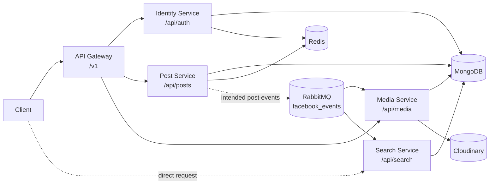

# Social Media Microservices

A Node.js microservices backend for identity, posts, media uploads, and post search. The repository contains five independently packaged services:

- **API Gateway**: public entry point, JWT validation, proxying, rate limiting, and request logging.
- **Identity Service**: registration, login, access tokens, refresh tokens, and logout.
- **Post Service**: create, list, and delete posts with MongoDB and Redis caching.
- **Media Service**: multipart uploads to Cloudinary and media metadata handling.
- **Search Service**: text search over a denormalized MongoDB post collection.

> This README describes the code as it currently exists. The repository does not yet include Docker Compose, health checks, automated tests, seed data, or checked-in environment templates.

## Architecture



The gateway rewrites `/v1` to `/api` before forwarding requests. It adds the authenticated user's ID as `x-user-id` for post and media requests. Search has no gateway proxy route in the current implementation and must be called directly.

## Repository Layout

```text
api-gateway/
  src/server.js
  src/middlewares/
  src/utils/
identity-service/
  src/server.js
  src/controllers/
  src/database/
  src/models/
  src/routes/
  src/utils/
media-service/
  src/server.js
  src/controllers/
  src/eventhandler/
  src/models/
  src/routes/
  src/utils/
post-service/
  src/server.js
  src/controllers/
  src/middlewares/
  src/models/
  src/routes/
  src/utils/
search-service/
  src/server.js
  src/controllers/
  src/event-handlers/
  src/models/
  src/routes/
  src/utils/
```

Each service has its own `package.json`, lockfile, dependencies, and ignored `.env` file. There is no root `package.json`.

## Prerequisites

Install or provide:

- Node.js and npm
- MongoDB
- Redis
- RabbitMQ, for the event consumers
- A Cloudinary account, for media uploads

The services use ES modules where their package declares `"type": "module"`. Keep dependencies installed separately in each service directory.

## Configuration

Create a `.env` file in each service directory. Do not commit these files; `.env` is ignored by the repository.

### Common variables

| Variable      | Used by                       | Purpose                                                                                                                          |
| ------------- | ----------------------------- | -------------------------------------------------------------------------------------------------------------------------------- |
| `PORT`        | All services                  | HTTP port. Gateway and identity default to `3000`; post defaults to `3002`; media and search require a value for normal startup. |
| `NODE_ENV`    | Optional                      | Runtime environment value.                                                                                                       |
| `MONGO_URL`   | Identity, post, media, search | MongoDB connection string.                                                                                                       |
| `REDIS_URL`   | Gateway, identity, post       | Redis connection string.                                                                                                         |
| `JWT_SECRET`  | Gateway, identity             | Shared secret for signing and verifying access tokens.                                                                           |
| `RABBITQ_URL` | Post, media, search           | RabbitMQ connection string.                                                                                                      |

### Gateway variables

| Variable               | Example                 | Purpose                    |
| ---------------------- | ----------------------- | -------------------------- |
| `IDENTITY_SERVICE_URL` | `http://localhost:3001` | Identity service base URL. |
| `POST_SERVICE_URL`     | `http://localhost:3002` | Post service base URL.     |
| `MEDIA_SERVICE_URL`    | `http://localhost:3003` | Media service base URL.    |

### Media variables

| Variable           | Purpose                |
| ------------------ | ---------------------- |
| `CLOUD_NAME`       | Cloudinary cloud name. |
| `CLOUD_API_KEY`    | Cloudinary API key.    |
| `CLOUD_API_SECRET` | Cloudinary API secret. |

A practical local port arrangement is:

```dotenv
# api-gateway/.env
PORT=3000
IDENTITY_SERVICE_URL=http://localhost:3001
POST_SERVICE_URL=http://localhost:3002
MEDIA_SERVICE_URL=http://localhost:3003
REDIS_URL=redis://localhost:6379
JWT_SECRET=replace-with-a-shared-secret

# identity-service/.env
PORT=3001
MONGO_URL=mongodb://localhost:27017/social_identity
REDIS_URL=redis://localhost:6379
JWT_SECRET=replace-with-a-shared-secret

# post-service/.env
PORT=3002
MONGO_URL=mongodb://localhost:27017/social_posts
REDIS_URL=redis://localhost:6379
RABBITQ_URL=amqp://localhost

# media-service/.env
PORT=3003
MONGO_URL=mongodb://localhost:27017/social_media
RABBITQ_URL=amqp://localhost
CLOUD_NAME=your-cloud-name
CLOUD_API_KEY=your-cloud-api-key
CLOUD_API_SECRET=your-cloud-api-secret

# search-service/.env
PORT=3004
MONGO_URL=mongodb://localhost:27017/social_search
RABBITQ_URL=amqp://localhost
```

Use real secrets and connection strings in a local environment. The example values above are only placeholders.

## Installation

Install each service independently:

```bash
cd api-gateway && npm install
cd ../identity-service && npm install
cd ../post-service && npm install
cd ../media-service && npm install
cd ../search-service && npm install
```

## Running Locally

Start infrastructure first, then start each service from its own directory in a separate terminal:

```bash
cd identity-service && npm run dev
cd post-service && npm run dev
cd media-service && npm run dev
cd search-service && npm run dev
cd api-gateway && npm run dev
```

The gateway is intended to be used at `http://localhost:3000`. With the port arrangement above, the direct service URLs are:

- Identity: `http://localhost:3001`
- Posts: `http://localhost:3002`
- Media: `http://localhost:3003`
- Search: `http://localhost:3004`

The gateway and identity service provide both `npm start` and `npm run dev`. Post, media, and search currently define only `npm run dev`; their entry point can also be run directly with `node src/server.js` after dependencies are installed.

## Authentication Flow

1. Register with the identity endpoint.
2. Log in to receive an access token and refresh token.
3. Send the access token as `Authorization: Bearer <access-token>` to protected gateway routes.
4. The gateway verifies the JWT and forwards the decoded `userId` as `x-user-id`.

Access tokens contain `userId` and `username` and expire after 60 minutes. Refresh tokens are random values stored in MongoDB for seven days and have a TTL index.

The service-level post, media, and search middleware trusts the presence of `x-user-id`; it does not independently verify the JWT. These services should therefore normally be reachable only through trusted internal networking or the gateway.

## API Reference

### Identity

These routes are available directly under `/api/auth` and through the gateway under `/v1/auth`.

| Method | Gateway path            | Body                                                            | Description                                                                    |
| ------ | ----------------------- | --------------------------------------------------------------- | ------------------------------------------------------------------------------ |
| `POST` | `/v1/auth/register`     | `{ "username", "email", "password" }`                           | Create a user. Username is 3-50 characters; password is at least 6 characters. |
| `POST` | `/v1/auth/login`        | `{ "email", "password" }`                                       | Return `accessToken`, `refreshToken`, and `userId`.                            |
| `POST` | `/v1/auth/refreshtoken` | Current controller expects the request body as the token value. | Rotate an existing refresh token.                                              |
| `POST` | `/v1/auth/logout`       | Current controller expects the request body as the token value. | Delete a refresh token.                                                        |

Example registration:

```bash
curl -X POST http://localhost:3000/v1/auth/register \
  -H "Content-Type: application/json" \
  -d '{"username":"alex","email":"alex@example.com","password":"secret123"}'
```

### Posts

Protected gateway routes are available under `/v1/posts`; direct service routes are under `/api/posts`.

| Method   | Path                                  | Body/query                      | Description                                              |
| -------- | ------------------------------------- | ------------------------------- | -------------------------------------------------------- |
| `POST`   | `/v1/posts/create-post`               | `{ "content", "mediaIds": [] }` | Create a post for the authenticated user.                |
| `GET`    | `/v1/posts/all-posts?page=1&limit=10` | Query parameters optional       | Return paginated posts, cached in Redis for 300 seconds. |
| `DELETE` | `/v1/posts/delete/:id`                | None                            | Delete a post by MongoDB ID.                             |

Example:

```bash
curl -X POST http://localhost:3000/v1/posts/create-post \
  -H "Authorization: Bearer <access-token>" \
  -H "Content-Type: application/json" \
  -d '{"content":"Hello from the service","mediaIds":[]}'
```

Posts have a MongoDB text index on `content`. The `mediaIds` field is stored as an array of strings.

### Media

Protected gateway routes are available under `/v1/media`; direct service routes are under `/api/media`.

| Method | Path               | Body                                | Description                                          |
| ------ | ------------------ | ----------------------------------- | ---------------------------------------------------- |
| `POST` | `/v1/media/upload` | `multipart/form-data`, field `file` | Upload one file to Cloudinary. Maximum size is 5 MB. |
| `GET`  | `/v1/media/get`    | None                                | Return media records.                                |

Example:

```bash
curl -X POST http://localhost:3000/v1/media/upload \
  -H "Authorization: Bearer <access-token>" \
  -F "file=@./image.jpg"
```

### Search

Search is protected by `x-user-id` and is not currently proxied by the gateway. A caller must provide that header when calling the service directly:

```bash
curl "http://localhost:3004/api/search/post?query=hello" \
  -H "x-user-id: <user-id>"
```

The search service returns up to 10 results ordered by MongoDB text score. Search documents are intended to be populated from RabbitMQ post events.

## Events

Post, media, and search use the non-durable topic exchange `facebook_events`.

| Routing key    | Expected payload                                 | Consumer                                                                                   |
| -------------- | ------------------------------------------------ | ------------------------------------------------------------------------------------------ |
| `post.created` | `{ "postId", "userId", "content", "createdAt" }` | Search service creates a denormalized search document.                                     |
| `post.deleted` | `{ "postId", "mediaIds" }`                       | Search removes the post document; media removes associated Cloudinary objects and records. |

The post service currently connects to RabbitMQ and declares the exchange, but it does not publish either event. Consequently, search indexing and media cleanup are not connected to post creation/deletion yet.

## Data Stores

- **Identity MongoDB**: `User` and `RefreshToken` models. Passwords are hashed with Argon2. Refresh tokens expire through a MongoDB TTL index.
- **Posts MongoDB**: post owner, content, media IDs, and timestamps, with a content text index.
- **Media MongoDB**: Cloudinary public ID, original name, MIME type, URL, and user ID.
- **Search MongoDB**: denormalized post ID, user ID, content, and creation date, with text and date indexes.
- **Redis**: gateway-wide rate limiting; identity request and registration limiting; post listing cache and rate limiting.
- **Cloudinary**: media binary storage and deletion.
- **RabbitMQ**: topic-based post lifecycle events.

## Rate Limits

- Gateway: 50 requests per 15 minutes, stored in Redis.
- Identity: 10 requests per second per IP, plus 50 registration requests per 15 minutes.
- Posts: 50 create-post requests per 15 minutes.

The gateway's invalid-token response is currently `429`, while a missing token returns `401`.

## Current Implementation Notes

These are important when running or extending the project:

- `media-service/src/server.js` defines `startServer()` but does not invoke it, so the media HTTP server and RabbitMQ consumer do not start from the current entry point.
- Media upload returns a newly constructed metadata document but does not call `save()`, so the uploaded metadata is not persisted to MongoDB.
- The media error handler is registered before the media router, so it cannot catch normal downstream route errors through Express middleware ordering.
- Search requests reference `logger` in the controller without importing it, which can fail before the query runs.
- The media deletion event handler also references `logger` without importing it.
- Post cache invalidation calls Redis `key()` without a pattern and can cause post creation to report an error after saving the post.
- Post deletion does not currently return a response, invalidate the list cache, or publish a deletion event.
- Registration detects Joi validation errors but does not return immediately; its error path assumes `error.details[0]` exists.
- Refresh-token and logout controllers currently use the complete request body as the token value rather than extracting a named field.
- Gateway and identity default to the same port (`3000`), so separate `PORT` values are required for local startup.
- No automated tests are configured; each service's test script intentionally exits with `Error: no test specified`.

## Scripts

| Service     | Development   | Production-style start   | Tests                            |
| ----------- | ------------- | ------------------------ | -------------------------------- |
| API Gateway | `npm run dev` | `npm start`              | Placeholder, fails intentionally |
| Identity    | `npm run dev` | `npm start`              | Placeholder, fails intentionally |
| Post        | `npm run dev` | Run `node src/server.js` | Placeholder, fails intentionally |
| Media       | `npm run dev` | Run `node src/server.js` | Placeholder, fails intentionally |
| Search      | `npm run dev` | Run `node src/server.js` | Placeholder, fails intentionally |

## Related Source Files

- [API Gateway server](api-gateway/src/server.js)
- [Identity routes](identity-service/src/routes/identity-service.js)
- [Post routes](post-service/src/routes/post-routes.js)
- [Media routes](media-service/src/routes/media-routes.js)
- [Search routes](search-service/src/routes/searchpost-route.js)
- [RabbitMQ event helpers](search-service/src/utils/rabbitMq.js)
